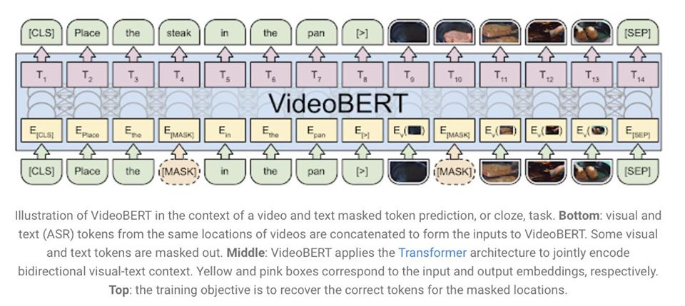
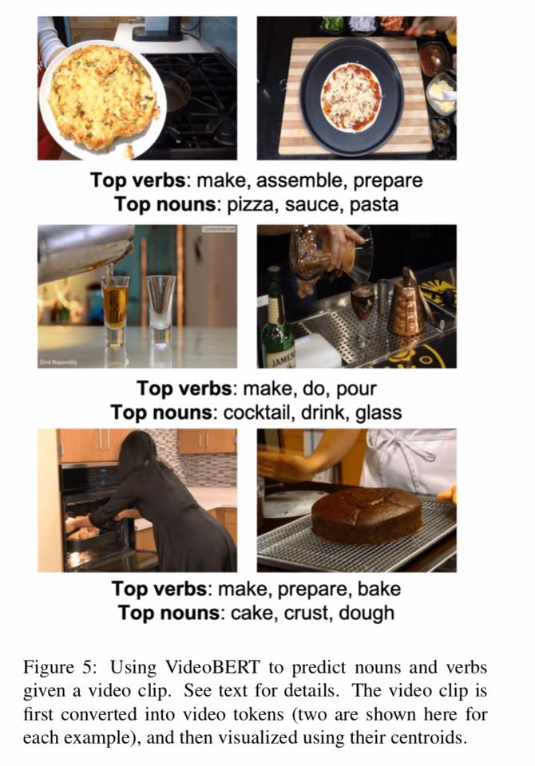
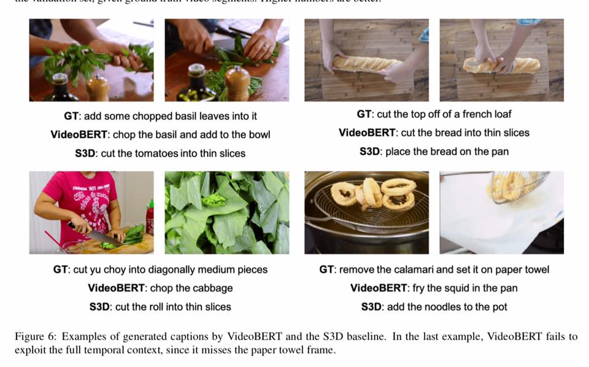

# AI-powered-by-Google-s-VideoBERT-

AI powered by Google’s VideoBERT can predict what will happen next in videos by learning visual-linguistic and visual representations from unlabeled videos.

Amazing self-supervised system that tackles various proxy tasks to learn temporal representations from unlabeled videos.

Read more at https://arxiv.org/pdf/1904.01766.pdf
